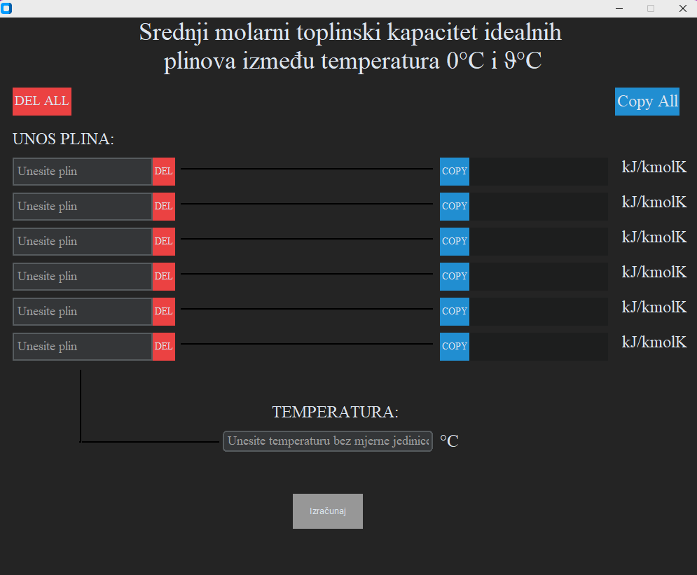

# DOK-ING Indeloop automatic calculator

## Project overview

- [DOK-ING Indeloop automatic calculator](#dok-ing-indeloop-automatic-calculator)
  - [Project overview](#project-overview)
  - [Goal](#goal)
  - [Graphical user interface](#graphical-user-interface)
    - [Preview:](#preview)
    - [How to use:](#how-to-use)
    - [Database of gases](#database-of-gases)
  - [Try it yourself !](#try-it-yourself-)

## Goal

The goal of this project was to make a typically time-consuming calculation simplified to just a few seconds.

## Graphical user interface

I have made this application using CustomTkinter ,a Python framework for modern looking desktop applications.

### Preview:

> [!NOTE]
> The application is developed in Croatian as it is not intended for broader use, but solely for our department.

### How to use:

This application is fairly easy to use as the main reason for this project was to make calculations easier and faster to do.

Usually, to get the middle molar heat capacity of a gas at a certain temperature, the engineer would need to do complex calculations which are both time and energy consuming.

- Problems this application has solved:
  - no time consuming calculations
  - no chance for errors
  - possibility to calculate middle molar heat capacity of ideal gas for more than one gas at the same temperature

### Database of gases

> [!IMPORTANT]
> One of my colleagues requested that the application be able to calculate the average molar heat capacity of certain gases, so I only included those specific gases in the application's database.

The data contains CP constant of these gases

- O2
- N2
- CH4
- H2
- H2O
- C2H2
- C2H4
- C2H5OH
- C2H6
- CO
- C2H8
- C6H6
- CO2
- H2S
- SO2

## Try it yourself !

I have included the AutCalcApp.exe file in this repository so that you can try this application for yourself. There is no need to install anything, just download the folder and run the AutCalcApp.exe file.
